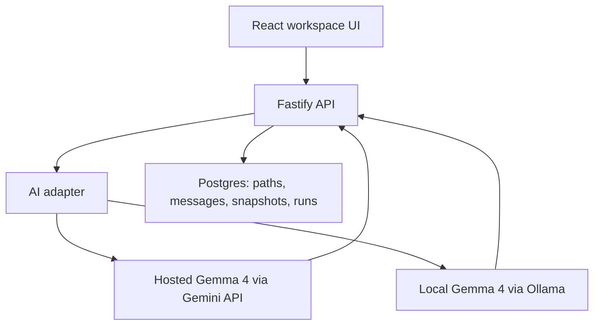
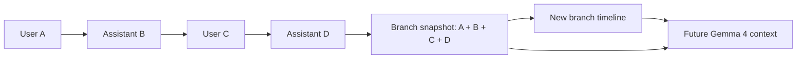
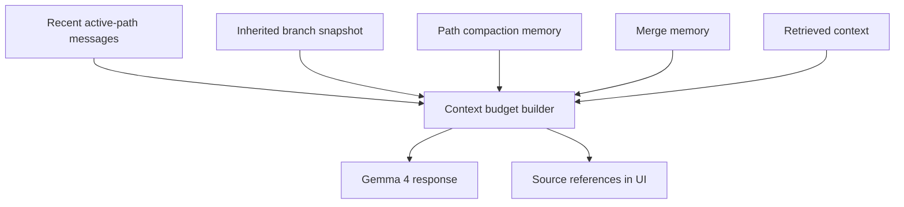

# How Gemma 4 Powers Bonsai AI

Bonsai AI is a node-based chat workspace built around Gemma 4. The app uses
Gemma 4 not only as a reply generator, but as the reasoning engine behind
branching conversations, merge memory, chat titles, path compaction, optional
web-grounded hosted responses, and local/private Ollama workflows.

The implementation deliberately keeps hosted Google Gemini API model IDs and
local Ollama model tags separate. Hosted mode uses Gemini API model names such
as `gemma-4-26b-a4b-it`, while local mode uses Ollama tags such as
`gemma4:e4b`. This lets the same application experience run in two different
deployment styles without pretending that hosted and local model identifiers are
interchangeable.



## Runtime Provider Modes

The active model provider is selected by `AI_PROVIDER` in
`apps/api/src/config/env.ts`.

Supported provider modes are:

| Mode | Provider used by the API | Primary use case |
| --- | --- | --- |
| `gemini` | Google Gemini API | Hosted Railway/demo deployments |
| `ollama` | Local Ollama HTTP API | Local/private Gemma 4 usage |
| `mock` | Mock adapter | Replay/evaluation/dev fallback |
| `auto` | Currently resolves to Google-hosted mode | Hosted-friendly default |

The default hosted Gemma 4 configuration is:

```env
GEMINI_AVAILABLE_MODELS=gemma-4-26b-a4b-it,gemma-4-31b-it
GEMINI_DEFAULT_MODEL=gemma-4-26b-a4b-it
GEMINI_MERGE_MODEL=gemma-4-26b-a4b-it
```

The default local Ollama configuration is:

```env
OLLAMA_BASE_URL=http://127.0.0.1:11434
OLLAMA_MODEL=gemma4:e4b
OLLAMA_MERGE_MODEL=gemma4:e4b
OLLAMA_NUM_CTX=2048
```

`apps/api/src/services/ai-adapter.ts` is the central provider router. All
higher-level product features call this adapter instead of calling Gemini or
Ollama directly. The adapter chooses the correct implementation for:

- chat generation
- streaming chat generation
- branch merge artifacts
- path compaction summaries
- conversation title generation

This keeps the rest of the app provider-neutral while still exposing
Gemma-specific capabilities where the UI needs them.

## Hosted Gemma 4 Through Gemini API

Hosted Gemma 4 support lives in `apps/api/src/services/gemini-adapter.ts`.

The hosted adapter uses `@google/genai` and initializes a `GoogleGenAI` client
from `GEMINI_API_KEY`. It validates requested hosted model IDs against
`GEMINI_AVAILABLE_MODELS`, so a frontend or stale local storage value cannot
silently send an unsupported model name to the Gemini API.

Hosted model behavior:

- `gemma-4-26b-a4b-it` is the default hosted chat model.
- `gemma-4-31b-it` is available as a larger hosted option.
- `GEMINI_MERGE_MODEL` controls the fallback model for merge and compaction
  workflows.
- Hosted model labels are formatted by `apps/api/src/routes/models.ts`:
  - `gemma-4-26b-a4b-it` becomes `Gemma 4 26B A4B`
  - `gemma-4-31b-it` becomes `Gemma 4 31B`

Hosted Thinking mode is also handled in the Gemini adapter. For supported
Gemma 4 hosted IDs, turning on Thinking mode adds:

```ts
thinkingConfig: {
  thinkingLevel: ThinkingLevel.HIGH
}
```

Fast mode deliberately omits `thinkingConfig`. The app does not use
`thinkingBudget` for Gemma 4.

Hosted mode can also use Google Search grounding. The frontend sends
`webSearchEnabled`, and `ai-adapter.ts` allows that only for the Google
provider. The Gemini adapter then adds the Google Search tool to the
generation config. Grounding metadata is returned with the response and later
rendered as citation/source chips in the UI.

## Local Gemma 4 Through Ollama

Local Gemma 4 support lives in `apps/api/src/services/ollama-adapter.ts`.

The Ollama adapter talks to:

- `GET /api/tags` to discover installed local Gemma 4 models.
- `POST /api/chat` to generate chat, merge, title, and compaction responses.

The app detects installed models whose Ollama family is `gemma4` or whose tag
starts with `gemma4:`. It keeps Ollama-native model names intact, for example:

| Ollama tag | UI label |
| --- | --- |
| `gemma4:e2b` | `Gemma 4 E2B` |
| `gemma4:e4b` | `Gemma 4 E4B` |
| `gemma4:26b` | `Gemma 4 26B` |
| `gemma4:31b` | `Gemma 4 31B` |

Local Thinking mode is sent to Ollama as:

```json
{
  "think": true
}
```

The API marks these local models with `thinkingConfigMode: "ollama-native"` so
the frontend can show Fast and Thinking variants without confusing Ollama's
native mode with hosted Gemini API thinking config.

Local mode intentionally disables web search. If a request tries to use web
search with Ollama, `ai-adapter.ts` throws an `AiProviderCapabilityError`
because Google Search grounding is a Gemini provider capability.

## Model Picker and Capability Metadata

The frontend loads available chat models through `GET /models/chat`, registered
in `apps/api/src/routes/models.ts`.

That endpoint returns model metadata used directly by
`apps/web/src/App.tsx`:

- `provider`
- `family`
- `label`
- `name`
- `supportsThinking`
- `thinkingConfigMode`

The picker title remains `Gemma 4` in both hosted and local modes, but the raw
provider-native model ID is shown as subtitle text. This is important because:

- hosted IDs look like `gemma-4-26b-a4b-it`
- local IDs look like `gemma4:e4b`

The UI renders exactly the model list returned by the API. It does not guess
hosted model names or normalize Ollama tags into hosted IDs.

For each model, the picker renders:

- a Fast variant
- a Thinking variant only when `supportsThinking` is true

The selected model and Thinking state are sent with each chat request as
`modelName` and `thinkingEnabled`.

## Chat Generation Flow

The main chat path starts in `apps/web/src/App.tsx`, where the composer submits
the current prompt, selected Gemma 4 model, Thinking mode, attachments, and
web-search setting.

The backend receives that at the path routes in `apps/api/src/routes/paths.ts`.
For normal chat it:

1. Creates the user's message in the selected path.
2. Builds a context bundle for that path.
3. Starts a `model_runs` record for observability.
4. Calls `generatePathReply` or `streamPathReply` from `ai-adapter.ts`.
5. Stores the assistant response with the actual model provider and model name.
6. Records token usage, cache mode, grounding metadata, and model-run status.
7. Triggers best-effort title generation and path compaction when appropriate.

Streaming responses use server-sent events:

- `run.started`
- `message.delta`
- `message.completed`
- `run.completed`
- `run.error`

This is why Gemma 4 answers appear incrementally in the UI while still ending
as durable database messages that can be branched, regenerated, merged, copied,
or inspected.

## Branching: Gemma 4 as a Path-Aware Assistant

Bonsai's core product idea is that an answer can become a branch. When the user
creates a branch from an assistant response or a block inside a response, the
app creates a new path linked to the original conversation graph.

Gemma 4 is prompted with path-aware instructions:

- continue the active path faithfully
- use only this path's prior messages as working memory
- do not claim knowledge from parent or sibling branches unless it appears in
  provided context
- cite internal context only through visible labels such as retrieved context,
  merge memory, or branch snapshots

This makes each branch feel like its own focused thought path rather than a
flat continuation of one global transcript.

## Branch Snapshots: Standalone Memory at the Fork Point

Each branch has its own standalone memory from the start of the source path to
the exact point where the user branched.

That memory is not just a UI illusion. When a branch is created,
`apps/api/src/services/path-service.ts` creates a durable branch snapshot:

1. It loads the source path messages up to and including the split message.
2. If the user branched from a specific response block, it preserves that
   selected block as the branch focus.
3. It formats the inherited transcript as branch memory.
4. It stores the result in `path_snapshots` with
   `snapshotKind: "split_memory"`.
5. It links the snapshot to the new branch path, the source path, and the
   source message.

Conceptually:



This means a branch can continue as if it remembers the conversation that led
to it, even though the branch has its own message timeline after the fork.
Sibling branches do not leak into each other. Parent path changes after the
fork do not rewrite the child branch's inherited memory. If a later discovery
should become shared context, the user explicitly merges it back through Bonsai
merge memory.

Hosted and local generation both receive this memory. In hosted mode,
`gemini-adapter.ts` includes the snapshot as inherited branch context and can
use Gemini cached content for large stable snapshots. In local mode,
`ollama-adapter.ts` prepends the same inherited snapshot text before the active
branch messages. The model provider changes, but the branch memory contract
stays the same.

## Context Bundles: What Gemma 4 Sees

Before each response, `apps/api/src/services/context-budget-service.ts` builds a
context bundle. That bundle is the structured memory package sent to Gemma 4.

It can include:

- recent messages from the active path
- inherited branch snapshot text from the fork point
- active path compaction memory
- merge memories brought back from other branches
- retrieval candidates from semantic/hybrid search



The bundle is token-budgeted using `CONTEXT_MAX_ESTIMATED_TOKENS`,
`CONTEXT_MAX_MERGE_MEMORIES`, and `CONTEXT_MAX_RETRIEVAL_CANDIDATES`.

The resulting source references are built by
`apps/api/src/services/source-reference-service.ts` and stored on assistant
messages. This powers the UI source chips that explain which context was used
for a Gemma 4 answer.

## Merge Memory: Gemma 4 Turns Branches Into Reusable Context

Branch merging is handled by `apps/api/src/services/merge-service.ts`.

When a branch contains something useful, the user can merge it into the main
path. That does not simply paste the entire branch transcript into the main
chat. Instead:

1. The app gathers the source branch transcript.
2. It gathers a small window of recent target/main-path context.
3. It includes the latest branch snapshot if one exists.
4. It calls `generateMergeArtifact` through `ai-adapter.ts`.
5. Gemma 4 creates a compact memory artifact.
6. The artifact is stored as `merge_summary` or `merge_full`.
7. A special `merge_memory` assistant message is created on the target path.
8. Future context bundles can include that merge memory.

This is how Bonsai lets useful branch discoveries become part of the main
conversation without flattening the whole graph into one long thread.

## Path Compaction: Gemma 4 Maintains Long-Running Thought

Long conversations can outgrow practical context windows. Bonsai handles this
with path compaction, implemented through
`apps/api/src/services/compaction-service.ts`.

After assistant responses, `paths.ts` enqueues path compaction jobs when a path
gets large enough. The compaction job calls `generatePathCompaction`, which
asks Gemma 4 to preserve:

- user goals
- preferences
- decisions
- constraints
- implemented changes
- unresolved questions
- important facts

The generated summary is stored as a path-scoped memory artifact. Later, that
artifact can be included in context bundles so Gemma 4 can continue the path
without needing every old message verbatim.

In hosted mode, branch snapshot caching can also use Gemini cached content via
`apps/api/src/services/cache-service.ts`. If a branch snapshot is large enough
and explicit caching is enabled, the app creates or reuses a Gemini cache record
for stable inherited context.

## Conversation Titles

After a meaningful first exchange, Bonsai asks Gemma 4 to generate a concise
sidebar title through `apps/api/src/services/conversation-title-service.ts`.

Title generation is best-effort:

- it only runs for placeholder titles such as `Untitled Chat`
- it ignores weak first messages like greetings
- it falls back to a sanitized title derived from the user's message if the
  model call fails
- it never blocks the actual chat response

This is a small but important way Gemma 4 makes the workspace easier to scan.

## Observability and Run Records

Every Gemma-powered operation can create a `model_runs` row in
`apps/api/src/db/schema.ts`.

Run records store:

- run type, such as `chat_response` or `merge_generation`
- model provider
- model name
- cache mode
- token usage
- request payload metadata
- response payload metadata
- latency
- failure text when something goes wrong

This is used by the admin/ops UI in the frontend to inspect failed or expensive
model calls. It also helps prove which Gemma 4 model powered a response.

Assistant messages also store:

- `modelProvider`
- `modelName`
- `status`
- structured `contentJson` with sources, grounding, lineage, or resilience data

That metadata is what lets the UI display response provenance and keep failed
responses debuggable without showing raw provider JSON to normal users.

## Error Handling for Hosted and Local Gemma 4

Provider errors are normalized in `apps/api/src/services/api-error.ts`.

The classifier keeps hosted and local failures separate:

- hosted quota or high-demand errors become friendly Gemma 4 hosted messages
- invalid hosted model IDs suggest choosing another model
- Ollama connection failures explain how to start Ollama
- missing local Gemma 4 tags suggest installing a local model
- Thinking-mode capability problems become actionable UI messages

The frontend then renders structured error metadata as polished toasts and
failed-response cards. Raw provider details remain available through copy
details or admin run inspection, but the normal user experience stays readable.

## Why Gemma 4 Matters To The Product

Gemma 4 is not a replaceable detail in Bonsai AI. It is the model family around
which the workspace is shaped.

Gemma 4 powers:

- normal assistant replies
- streaming responses
- model thinking modes
- hosted web-grounded answers
- local/private Ollama answers
- branch-specific continuation
- branch merge summaries
- path compaction memory
- conversation titles
- source-aware answer provenance
- readable recovery when provider errors happen

The result is a chat app that treats AI work as an explorable graph rather than
a single linear transcript. Gemma 4 supplies the language and reasoning layer,
while Bonsai supplies the workspace structure: paths, branches, merge memory,
context bundles, source references, and model-run observability.

## Important Code Map

| Area | File |
| --- | --- |
| Env defaults and provider config | `apps/api/src/config/env.ts` |
| Provider router | `apps/api/src/services/ai-adapter.ts` |
| Hosted Gemini API adapter | `apps/api/src/services/gemini-adapter.ts` |
| Local Ollama adapter | `apps/api/src/services/ollama-adapter.ts` |
| Model metadata endpoint | `apps/api/src/routes/models.ts` |
| Chat and streaming routes | `apps/api/src/routes/paths.ts` |
| Branch creation and split snapshots | `apps/api/src/services/path-service.ts` |
| Branch snapshot storage | `apps/api/src/db/schema.ts` |
| Context bundle builder | `apps/api/src/services/context-budget-service.ts` |
| Source/reference metadata | `apps/api/src/services/source-reference-service.ts` |
| Branch snapshot cache support | `apps/api/src/services/cache-service.ts` |
| Merge memory generation | `apps/api/src/services/merge-service.ts` |
| Path compaction | `apps/api/src/services/compaction-service.ts` |
| Conversation titles | `apps/api/src/services/conversation-title-service.ts` |
| Model run observability | `apps/api/src/services/model-run-service.ts` |
| Frontend model picker and composer | `apps/web/src/App.tsx` |
